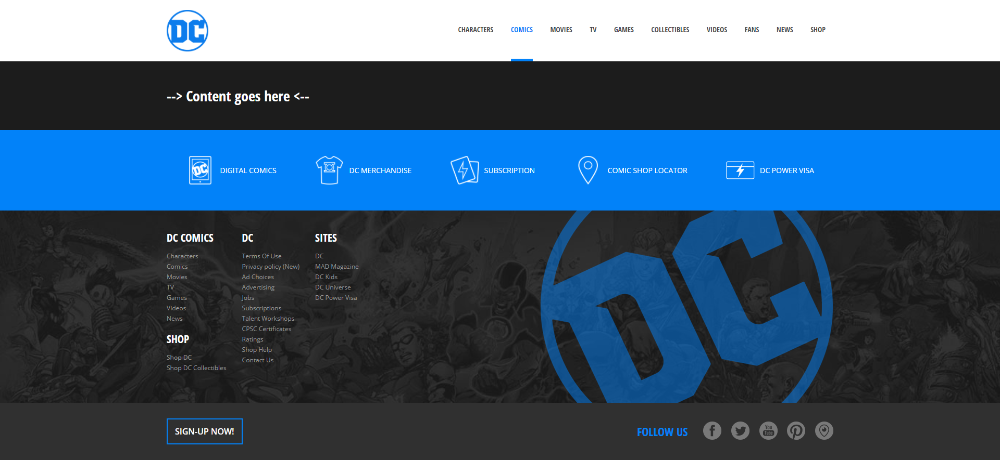

> Esercizio Vite DC Comics

## Vite DC Comics
- DESCRIZIONE:
    - Create un nuovo progetto utilizzando Vite e Vue 3 e definite i componenti necessari per strutturare il layout come da screenshot allegato.

    - Quando la struttura a macroblocchi è pronta, popolate le voci di menu dinamicamente usando i data del componente.
    
- BONUS
  - Creare un componente aggiuntivo per gestire la fascia azzurra con le icone.

- CONSIGLI:
  - Per oggi diamo priorità alla struttura: quando è tutto bello solido, passiamo al Sass!
## Tecnologie

- HTML
- CSS
- JAVASCRIPT
- BOOTSTRAP